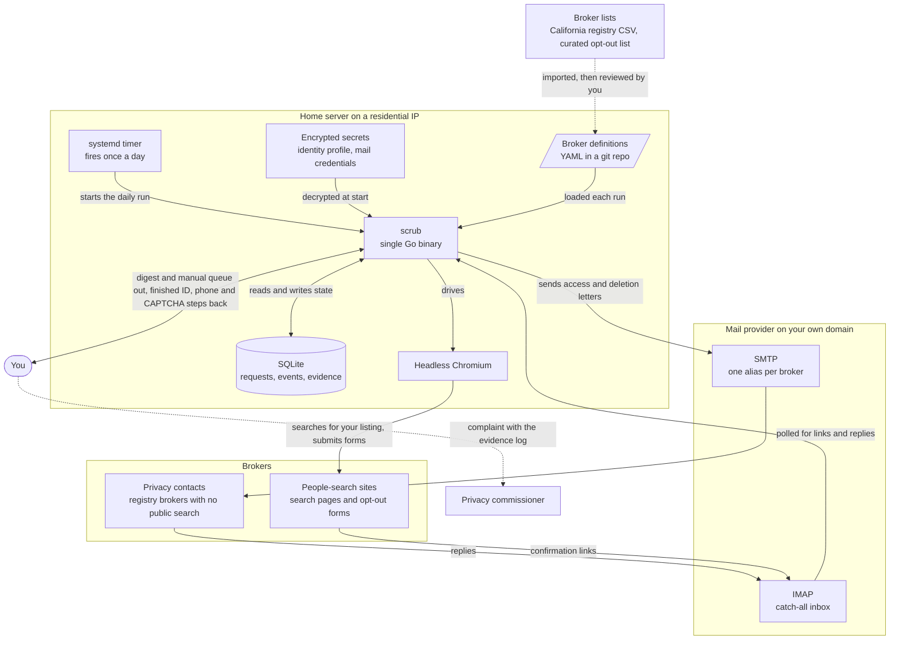
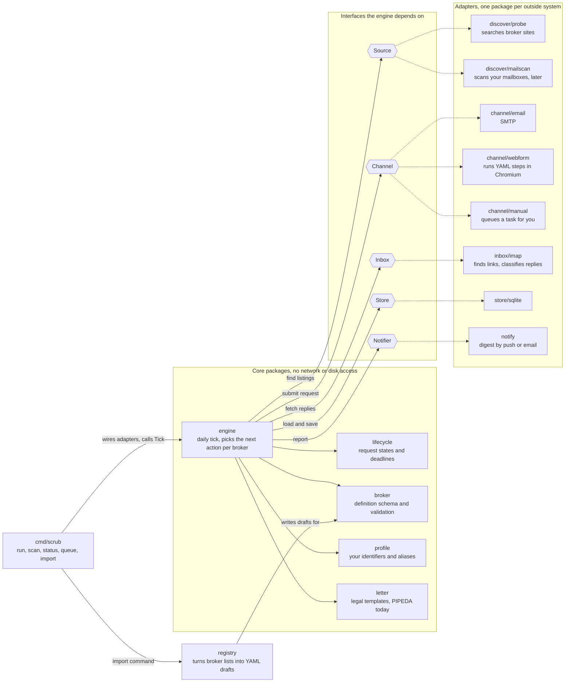
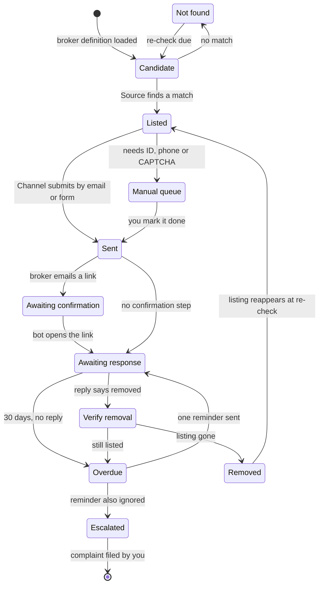

# Architecture

Three diagrams: the system, the code, and the request lifecycle. They describe the planned design. Nothing in them is implemented yet.

## 1. System

One binary on a home server talks to brokers through a browser and a mailbox, and reads their answers back from the same mailbox. Dotted arrows are steps I do by hand.

Notes:

- The binary is built from `cmd/scrub`. The systemd timer belongs to deployment, which is not designed. The repository has no unit files.
- The server uses a residential connection because people-search sites often block datacenter addresses.
- Each broker gets its own alias on a domain the operator controls. Replies to an alias route back to the right request. An alias that starts receiving spam shows who resold it.
- The secrets file holds the identity profile and mail credentials. Its format and key handling are not designed. `filippo.io/age` is the candidate library.
- Broker definitions are data in the repository and are loaded each run, so a fix to a definition needs no rebuild.
- Broker lists are imported by `internal/registry` and become definitions only after review by hand.
- SQLite holds every request, reply and timestamp. That log is the evidence file for a complaint.
- Filing a complaint with the Office of the Privacy Commissioner of Canada is the operator's decision.

## 2. Code

The engine holds every decision and imports no adapter. Solid arrows are calls. Dotted arrows point from an interface to the packages that implement it. In the repo these packages live under `internal/`.

Notes:

- Core packages are `engine`, `lifecycle`, `broker`, `profile` and `letter`. They import no adapter package, and their signatures take no file paths, connections or clients.
- The five interfaces are declared in `internal/engine/ports.go`. Each adapter declares one struct and a compile-time assertion that the struct satisfies its interface.
- Only `cmd/scrub` imports adapters, so adapters do not import one another.
- `registry` sits outside the core. It imports `broker` and reads from an `io.Reader`.
- `discover/mailscan` is marked "later". Which discovery source is built first is not decided.
- How the engine picks among the three channels is not decided.
- The diagram places reply classification in `inbox/imap`. Whether that decision belongs in the engine is an open question in `internal/engine/README.md`.

## 3. Request lifecycle

Each broker has one request record. A daily run moves a record at most one step. The 30 days is PIPEDA's response clock. The re-check interval is set per broker.

Notes:

- Each state maps to a `lifecycle.State` constant:

  | Diagram label | Constant |
  |---|---|
  | Candidate | `Candidate` |
  | Not found | `NotFound` |
  | Listed | `Listed` |
  | Manual queue | `ManualQueue` |
  | Sent | `Sent` |
  | Awaiting confirmation | `AwaitingConfirm` |
  | Awaiting response | `AwaitingResponse` |
  | Verify removal | `Verify` |
  | Overdue | `Overdue` |
  | Removed | `Removed` |
  | Escalated | `Escalated` |

- A request is sent once per listing. It is re-sent only when a listing reappears, which is the `Removed` to `Listed` transition.
- `Overdue` allows one reminder, rendered as `letter.Reminder`. If the reminder is also ignored, the record moves to `Escalated`.
- `Escalated` is final for the bot. The complaint is filed by the operator.
- The diagram does not show the access request sent to a broker with no public search. This is an open question in `internal/lifecycle/README.md`.
